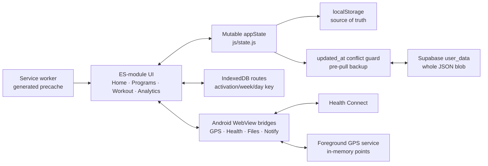

# Helyx Comprehensive Product Audit

**Audit date:** 14 July 2026  
**Scope:** Web/PWA product, Android WebView shell, onboarding, program discovery, workout execution, running, analytics, persistence/sync, export, security, accessibility, observability, test/release systems  
**Launch context:** Android public beta, free at launch; iOS and billing intentionally excluded

This is an evidence-based audit of the repository at `4079068` on `main`. It does not assume that a feature works because a screen or code path exists. Findings are based on source inspection, automated checks, focused data-flow tracing, and representative mobile browser journeys. Device-only behavior that could not be executed locally is labelled as a limitation rather than presented as proven.

## Executive assessment

Helyx has a credible, unusually broad hybrid-training product inside a compact vanilla-JavaScript architecture. The core loop is recognizable: choose a program, see the next mission, execute a session, and review progress. Several foundational decisions are strong: activation-scoped program history, date-attributed calendar analytics, conflict-aware cloud writes, RLS, generated offline precaching, confidence-aware Hybrid Score copy, PII scrubbing, and a native foreground GPS service.

The current build is not ready for a public beta. Three user-data defects and two release-integrity gaps need resolution first:

1. Local-day handling is fragmented and fails streak behavior in Sydney; some records can be stamped as the prior UTC day.
2. A second run in the same program day overwrites the first in both workout state and route storage/export.
3. A failed state migration is caught but the state is still stamped as current, preventing a safe retry.
4. Android's download handler does not support the `blob:` exports generated by Settings, so the only user-accessible backup path for unsynced route data is not implemented end to end.
5. production Pages and signed Android releases are not gated on the repository's verification jobs, while the current test suite already has four failures.

The recommendation is a narrow **Beta Integrity PR** before further feature work. It should unify local dates, introduce session-level run/route identity with a migration, make migrations transactional/retryable, route Android exports through the native file bridge, and make release workflows depend on verified tests and Android checks. Do not broaden that PR into a visual redesign or program-schema rewrite.

## Product scorecard

Scores reflect public-beta readiness, not ambition or feature count.

| Area | Score | Assessment |
|---|---:|---|
| Core value proposition | 8/10 | The strength + running promise is clear and supported by real program, cockpit, GPS, and analytics depth. |
| Onboarding and activation | 6/10 | Fast and visually coherent, but goal/equipment choices do not fully reach persisted behavior and beginner recommendations hide difficulty. |
| Program discovery and prescription | 6/10 | Catalog and plan views are strong; prescription schema cannot faithfully model many serious training methods. |
| Workout execution | 7/10 | Useful cockpit, swaps, plates, rest timer, and quick logging; bodyweight entry and incomplete-session semantics need work. |
| Running and route integrity | 4/10 | Native foreground tracking is promising, but identity, durability, timestamp, and export defects threaten trust. |
| Analytics and coaching | 6/10 | Calendar attribution and shared models are good; some recommendations sound more certain than the evidence permits. |
| State, sync, and portability | 5/10 | Conflict guard and pre-pull backup are strong; blob sync, migration failure handling, shallow imports, and export omissions remain material. |
| Mobile UX and accessibility | 5/10 | Focused visual hierarchy and no observed horizontal overflow; hidden modal focus targets, small controls, and tiny text are widespread. |
| Android integration | 5/10 | Hardened WebView origin and useful bridges; export, Health Connect control, and process-death GPS behavior are incomplete. |
| Security and privacy | 7/10 | Proven RLS, trusted origins, cleartext restrictions, and PII scrubbing; remote privileged scripts and unsafe imported/displayed strings need hardening. |
| Offline/PWA reliability | 8/10 | Generated dependency graph and atomic cache install are sound; full lifecycle/device validation is still missing. |
| Test and release confidence | 5/10 | 764 Node tests and useful scripts exist; four tests fail and deploy/release jobs can bypass them. |
| **Overall public-beta readiness** | **5.8/10** | Strong product core, but user-data and release gates must be fixed before external distribution. |

The requested decision categories, consolidated from the detailed scorecard, are:

| Required category | Score | Reason |
|---|---:|---|
| Core workout logging | 7/10 | Fast after discovery, with swaps/plates/timer/undo; bodyweight and completion semantics hold it back. |
| User experience | 6/10 | Clear core loop, but visible promises and accessibility are inconsistent. |
| Program system | 6/10 | Excellent breadth/preview/activation isolation, limited prescription depth and continuity. |
| Analytics/Brain | 6/10 | Strong calendar models, uneven confidence/scope and some authoritative copy. |
| Reliability/offline | 5/10 | Strong precache/conflict safeguards, offset by migration, route, and Android backup defects. |
| Architecture | 6/10 | Viable modules and several pure cores, with identity/atomicity gaps and cross-cutting god modules. |
| Android APK | 5/10 | Hardened custom shell, but export, Health contract, and GPS durability need device-proven closure. |
| Security/privacy | 7/10 | Proven RLS and solid WebView/PII controls; privileged remote code and imported markup need hardening. |
| Maintainability | 5/10 | Large test count and reachable graph, but red/flaky behavioral coverage and fragmented UI primitives. |
| **Overall product readiness** | **5.8/10** | Valuable beta product, not yet trustworthy enough to publish. |

## What is already strong

- **Program-run isolation:** `activeActivationId`, week stamps, and archived activation keys protect completed history from leaking into a restarted or switched program.
- **Honest weekly attribution:** the weekly aggregate and detail navigators use stamped local dates and calendar weeks rather than `state.currentWeek`.
- **Cloud overwrite guardrails:** server `updated_at`, a pre-save conflict choice, and pre-cloud-pull snapshots turn silent blob clobbering into an explicit decision.
- **Security baseline:** Supabase RLS has an adversarial verification record; the Android WebView restricts cleartext traffic, trusted origins, file access, and release debugging.
- **Offline install model:** the service worker derives required assets from the module graph and refuses to activate an incomplete required cache.
- **Core workout utility:** exercise substitution preserves logged sets; plate math, rest timer, day swipes, and simple deterministic coach answers are useful during a live session.
- **Hybrid Score restraint:** the product can show a provisional score and confidence rather than presenting all scores as equally certain.
- **Reachable architecture:** all 151 non-vendor JavaScript modules were reachable from application/service-worker entry points in the audit graph; this is not a repo dominated by abandoned feature folders.

## Main weaknesses

- **Identity is inconsistent at the storage boundaries:** program activations are stable, but workouts/runs/routes are not session-identified end to end.
- **Date correctness is not systemic:** strong calendar-week analytics sit on top of state-writing paths that still manufacture UTC day strings.
- **The UI sometimes promises more than the model proves:** selected equipment, completed workouts, phase names, readiness advice, and exported history can be semantically inaccurate.
- **Platform integration is present but not closed-loop:** Android GPS, Health Connect, and file bridges exist, yet durability, preference enforcement, and export success are incomplete.
- **Release confidence is weaker than the feature surface:** behavioral browser tests skip on a clean install, Android integration coverage is narrow, and publication is not gated on verification.
- **Prescription breadth exceeds schema depth:** a large catalog is resolved mainly through one shared weekly sets/reps modifier and free text.

## Perspective-by-perspective assessment

| Perspective | Verdict | Most important evidence-backed finding |
|---|---|---|
| A — Brand-new user | The value proposition and first mission are clear, but onboarding records choices it does not fully honor. | Goal is not durably persisted; Home equipment leaves detailed gym items enabled; an undisclosed Intermediate plan can be recommended to a Beginner (AUD-06, AUD-27). |
| B — Daily experienced user | The cockpit can be faster than paper once learned, but cross-program exercise history and data portability are not mature enough for years of use. | Progression searches the same weekday/current activation; archived CSV history and same-day routes can be lost (AUD-02, AUD-08, AUD-16). |
| C — Program browsing/activation | Catalog, equipment fit, Plan timeline, and engine-backed previews are valuable; discovery repeats itself and activation continuity is incomplete. | Global phase labels can contradict the program; partial workouts can be archived and old activations cannot be resumed (AUD-07, AUD-21). |
| D — Workout logger | Swaps, plates, rest timing, and set logging are useful, but bodyweight entry and completion semantics create avoidable friction. | One set/no run received full completion celebration; Pull-Up bodyweight mode was hidden; intervals were labelled Recovery (AUD-14, AUD-15). |
| E — Home/navigation | Home answers “what now?” well and avoids a telemetry strip. | Program phase and evidence-poor readiness advice can make the primary guidance wrong or overconfident (AUD-07, AUD-10). |
| F — Analytics/Brain | Calendar attribution and Hybrid Score confidence are strong; advice confidence and scope are inconsistent. | A single available signal can normalize into high readiness, while PR/time-trial copy lacks exercise/distance-specific evidence (AUD-10, AUD-25). |
| G — Visual design | The athletic card language is coherent, but implementation has too many bespoke styles and small controls. | 704 inline style occurrences, 526 `!important` occurrences, and widespread sub-44px controls (AUD-13, AUD-29). |
| H — Accessibility | Reduced-motion/pinch-zoom foundations exist; modal and focus behavior is not beta-ready. | Thirteen inactive dialog-like containers retained focusable descendants; several closed sheets retained modal semantics (AUD-12). |
| I — Software architecture | ES modules remain viable; data identity, migration atomicity, and large cross-cutting files cause real defects. | Failed migrations can be stamped current; state/IDB/native layers disagree on session identity (AUD-02, AUD-03). |
| J — Program schema | Legacy simplicity supports catalog volume but not precise prescriptions. | 539 lift slots mostly inherit a shared weekly target; structured per-lift/run concepts are absent (AUD-09). |
| K — Reliability/offline | Atomic precaching and sync conflict safeguards are good; backup and recovery have serious holes. | Android export path is incomplete, migration failure is unsafe, and multiple runs can overwrite (AUD-02–04). |
| L — Security/privacy | RLS and WebView origin controls are strong; privileged runtime dependencies and imported markup need hardening. | Mutable remote JS can execute alongside native bridges; shallow imported state reaches HTML-producing paths (AUD-17, AUD-20). |
| M — Android APK | The custom shell has purposeful native integrations and security controls; device durability/portability is not proven. | `blob:` export is unsupported, GPS points are memory-only, and Health field choices do not drive permissions (AUD-04, AUD-11, AUD-18). |
| N — Performance | Current analytics are fast and initial assets are modest; lifetime whole-blob writes are the main scale risk. | A synthetic five-year state reached ~1.41 MB before localStorage/cloud/network overhead (AUD-23). |
| O — Maintainability/testing | The numerical test suite is substantial but misses critical behavioral boundaries. | Current suite is red; viewport checks skip; migration/export/GPS/Health/modal behaviors lack end-to-end coverage (AUD-01, AUD-24). |

## Consolidated top 10

1. **AUD-01 — canonical local dates:** proven wrong-day records and three failing streak tests.
2. **AUD-02 — session-level run/route identity:** proven silent replacement/collapse of legitimate history.
3. **AUD-03 — transactional migrations:** a failed migration can be permanently treated as successful.
4. **AUD-04 — Android export:** the launch platform cannot consume the `blob:` backup flow generated by the app.
5. **AUD-05 — release gates:** production artifacts can bypass failing verification.
6. **AUD-06 — onboarding truth:** goal/equipment selections do not reliably control later behavior.
7. **AUD-07 — program-aware phases:** central guidance and score weighting can use the wrong plan phase.
8. **AUD-10 — evidence-honest readiness:** sparse inputs can produce overly authoritative coaching.
9. **AUD-11 — Health Connect contract:** visible privacy controls do not govern the actual request/read pipeline.
10. **AUD-12/AUD-14 — accessible, truthful completion:** invisible modal focus and full celebration for partial work damage usability and trust.

## Ranked findings

Severity definitions:

- **Blocker:** credible risk of user-data loss/corruption, broken backup, security boundary failure, or unverified public release.
- **Significant:** undermines a core journey, accuracy, accessibility, or maintainability and should be resolved in the beta hardening phase.
- **Moderate:** real quality or trust issue that can follow the beta integrity slice.
- **Minor:** polish or simplification opportunity.

| ID | Severity | Finding | User impact | Evidence summary |
|---|---|---|---|---|
| AUD-01 | Blocker | Local-day logic is split between canonical helpers and raw UTC conversions. | A workout, weigh-in, streak, or score can land on the wrong local day; streak-freeze tests fail in Sydney. | `js/dates.js`; `js/brain/streak.js:isoOffset`; raw `toISOString().slice(0, 10)` calls; three failing `streak_freeze` tests. |
| AUD-02 | Blocker | Run and route identity is activation/week/day rather than session-level. | A second same-day run replaces the first; route export can also collapse records from different activations. | `js/run-logger.js`; `js/gps-tracker.js`; `js/db.js:getAllRoutes`; `js/state/route-portability.js`. |
| AUD-03 | Blocker | Failed migrations are skipped and the state is nevertheless stamped current. | A partially migrated state may never retry the failed step, creating silent schema corruption. | `js/state/migrations.js:migrateState`. |
| AUD-04 | Blocker | Web export creates `blob:` downloads but Android handles only data/http(s) downloads. | Android users may be unable to save JSON/CSV backups; route data has no cloud fallback. | `js/settings.js`; `js/state/import-export.js`; `android/.../MainActivity.kt:handleDownload`; existing `saveTextFile` bridge is unused by these flows. |
| AUD-05 | Blocker | Production deploy and signed release workflows are not gated on verification. | A release can be published while Node tests, browser checks, or Android lint/tests are failing. | `.github/workflows/pages.yml`, `release.yml`, `tests.yml`, `android.yml`; current suite has four failures. |
| AUD-06 | Significant | Onboarding selections are only partially persisted. | A selected non-hybrid goal remains the default; “Home” equipment still leaves a gym equipment map checked, changing fit/substitution behavior. | `js/onboarding.js:_finish`; browser onboarding then Settings inspection. |
| AUD-07 | Significant | One global phase-name array is applied across programs. | Home, briefing, and Hybrid Score can call a normal/deload week by the wrong phase and reweight the score incorrectly. | `js/home.js`, `js/app.js`, `js/brain/hybrid-score.js`; compare modifier-aware modules. |
| AUD-08 | Significant | Progression/history searches only prior numeric weeks in the same day slot. | Moving a lift to another weekday or starting a new activation makes its recent performance invisible to progression, stall, and ghost logic. | `js/engine.js:computeDiagnosticForLift`; archived activations are ignored. |
| AUD-09 | Significant | The program schema has one shared weekly sets/reps modifier and mostly bare-string lifts. | It cannot faithfully express per-lift RPE/RIR, rest, tempo, warm-ups, supersets, back-offs, AMRAP, or structured run intervals. | `js/schema.js`, `js/engine.js`; 539 catalog lift slots, only 33 detected text overrides and 40/41 lift programs with none. |
| AUD-10 | Significant | Readiness and advice can sound definitive with sparse or non-specific evidence. | A single signal can produce a high readiness score and PR/time-trial language without confidence or sport-specific proof. | `js/analytics/readiness-scoring.js`; `js/analytics/recommendations.js`. |
| AUD-11 | Significant | Health Connect field controls do not control requested/applied data, and native permissions/readers diverge. | Privacy choices appear effective when they are not; VO2 max is offered but not read; HRV/history permission declarations are inconsistent. | `js/health/health-bridge.js`; settings sync fields; `HybridHealthBridge.kt`; `AndroidManifest.xml`. |
| AUD-12 | Significant | Closed sheets/modals remain in the accessibility tree and tab order. | Keyboard and assistive-technology users can reach invisible controls; multiple elements claim modal state simultaneously. | Browser snapshot found 13 inactive dialog-like containers with focusable descendants and no `inert`/`aria-hidden`. |
| AUD-13 | Significant | Many interactive targets and text sizes are below comfortable mobile/accessibility thresholds. | Tabs, bookmarks, chips, dots, and set controls are harder to hit; secondary guidance can be difficult to read. | At 390px, 115/129 measured visible interactive elements had one dimension below 44px; CSS includes extensive 0.5–0.68rem type. |
| AUD-14 | Significant | “Session Complete” is shown after an arbitrarily partial workout with no warning. | One of 12 lift sets and no prescribed run can receive celebratory completion copy, weakening adherence trust. | Browser workout journey; `js/workout.js` finish path versus completion predicates used by analytics/Brain. |
| AUD-15 | Significant | Run-type detection treats interval recovery text as a recovery run. | `6×800m (90s recovery)` is displayed/classified as “Recovery,” distorting the workout cue and downstream interpretation. | `js/workout.js:_detectRunType` checks `recovery` before interval patterns. |
| AUD-16 | Significant | CSV export skips archived activation weeks and lacks robust CSV escaping. | Long-term users receive an incomplete “training history” export, and notes/names can produce malformed rows. | `js/state/import-export.js`; archived keys become `NaN` when coerced. |
| AUD-17 | Significant | Remote JavaScript runs on the privileged appassets origin. | A CDN/vendor compromise could access native bridges from the trusted WebView origin. | CSP permits jsDelivr; Supabase is SRI-pinned, Sentry is remotely loaded without SRI; bridges are attached to the page. |
| AUD-18 | Significant | Native GPS points exist only in memory and the service is non-sticky. | Android process/OEM termination can lose an active run despite “foreground service” expectations. | `GpsPointStore.kt`; `GpsTrackingService.kt:START_NOT_STICKY`. Device frequency is unverified. |
| AUD-19 | Moderate | GPS run start time is cleared before the route record is created. | Saved route `startTs` becomes stop time, damaging chronology/duration provenance. | `js/gps-tracker.js:stopTracking`. |
| AUD-20 | Moderate | Imports are shallowly validated and some imported strings reach HTML. | Invalid state can enter persistence; avatar/name content expands the stored-markup attack surface. | `js/state/import-export.js:isAppState`; avatar rendering; `js/brain/celebration.js`. |
| AUD-21 | Moderate | Program activation warns but permits switching mid-workout and offers no resume-old-activation UI. | Partial work is archived/disappears from the cockpit; returning to an old program starts another activation. | activation confirmation and archive flow. |
| AUD-22 | Moderate | Unknown program IDs silently fall back to Hybrid Engine. | A damaged import/state can render one program while retaining a different ID, hiding the integrity problem. | program lookup fallback path. |
| AUD-23 | Moderate | Full-state persistence and cloud upsert scale with lifetime history. | Every critical save serializes a growing blob and cloud writes remain last-write-wins at blob level. | `js/state.js`; synthetic 5-year state ~1.41 MB and ~4.8 ms Node stringify, excluding browser/storage/network cost. |
| AUD-24 | Moderate | Browser and Android behavioral coverage is thin. | Clean installs skip viewport scripts without Playwright; Android has two small JVM test areas and no bridge/export/GPS/Health integration coverage. | scripts, package dependencies, Android tests, CI workflows. |
| AUD-25 | Moderate | Similar metric families and misleading scope labels remain. | “Lifetime PR” can mean only the active numeric program weeks; duplicate readiness/load paths can drift. | `strength-calcs.js`, strength view, `metrics-load.js`, primary readiness model. |
| AUD-26 | Moderate | The feature surface outruns the hierarchy of the core loop. | Programs repeat discovery controls; advanced readiness/load and fasting compete with plan/train/track for attention. | Mobile Programs/Home/Start journeys and information architecture. |
| AUD-27 | Moderate | Beginner recommendations can include Intermediate programs without showing difficulty. | A novice can choose a workload above the stated level without informed disclosure. | Browser onboarding selected Beginner; Helyx Foundations recommended, card omitted its Intermediate label. |
| AUD-28 | Moderate | Health callback IDs are interpolated into JavaScript without the bridge escaping used elsewhere. | Current generated IDs are safe, but the bridge boundary is inconsistent and unnecessarily fragile. | `HealthConnectBridge.kt` versus `BridgeSafe` use in other bridges. |
| AUD-29 | Minor | CSS/component primitives are fragmented. | 704 inline style attributes/strings and 526 `!important` occurrences make accessibility and visual changes expensive. | `index.html`, JS renderers, CSS audit. |
| AUD-30 | Minor | The desktop presentation remains a narrow mobile column. | Functional for a PWA, but large screens provide little comparative context or planning utility. | 1280px browser inspection; no document overflow. |
| AUD-31 | Moderate | FIT import maps an anaerobic field into `aerobicTE` and reports import success before the destination callback completes. | Imported gym training-effect labels can be wrong, and a downstream save failure can follow a success toast. | `js/garmin.js:extractData`; callbacks in `js/app.js`. |

## Core journey audit

### 1. First launch and onboarding

The flow is legible and well paced: identity, goal, experience, equipment, recommendation, bodyweight, and notifications. The welcome transition lands users on a specific next mission, which is the correct end state.

The critical defect is semantic: the UI records choices that the state model does not consistently honor. `_finish` persists `equipmentTier` but not a tier-derived detailed equipment map, and it does not persist the selected goal into the durable setting consumed elsewhere. This is worse than a missing preference because it creates false confidence. The onboarding result screen should also disclose why an adjacent-level recommendation is included.

### 2. Home and next mission

Home successfully answers “what should I do next?” before asking users to interpret charts. The active-program card and next mission are the product's strongest hierarchy. Retain this.

The weak point is phase truth. A global phase-name cycle is presented as though it came from the active plan. Phase labels and deload-aware advice must derive from the selected program's current modifier, or be omitted when the program does not define a semantic phase.

### 3. Program discovery and selection

The library demonstrates real catalog breadth, useful category rails, filters, search, and plan detail. The week-by-week Plan tab is a good commitment aid.

At mobile width, the same taxonomy appears in tabs, chips, horizontal rails, and category browse cards. The next iteration should keep search, a small number of goal/equipment filters, “recommended for you,” and one full catalog entry point. Program prescription depth should be fixed in the model before adding more catalog volume.

### 4. Workout execution

The cockpit supports swaps, plate math, day navigation, rest timing, and per-set logging without forcing a separate screen. Those capabilities should remain.

Bodyweight exercise entry is too hidden: the first Pull-Up set appears to require a weight; the bodyweight mode is behind an overflow control, after which the user's bodyweight is filled. The tiny set-number control also conceals quick-log behavior. More importantly, Finish must distinguish **save partial session** from **complete prescribed session**. Celebration and streak/adherence language should require a documented completion threshold.

### 5. Running

Helyx has both manual and GPS flows, map persistence, native foreground tracking, and running analytics. The risk is that the surrounding identity model still assumes one run per day slot. Before beta, each run needs a stable session ID used consistently by workout state, route storage, GPS, import/export, and analytics. Users should be able to perform a prescribed run and an additional run without loss.

### 6. Progress and coaching

The product's best analytics decision is separating calendar-week attribution from program-week progression. Preserve the canonical weekly aggregator and shared chart models.

Advice must be confidence-gated. A readiness number computed from one available signal should not use the same presentation as a multi-signal score. PR/time-trial suggestions require recent exercise- or distance-specific evidence, not merely favorable aggregate load. Show “limited data” and a brief evidence explanation when confidence is low.

### 7. Settings, backup, and account trust

The existence of JSON, CSV, route portability, conflict choices, and account deletion is positive. But portability has to be complete and executable on the launch platform. JSON should preserve every activation and every route; CSV should include archived training and correctly escape fields; Android should write through a tested native save/share path. Import must validate and migrate in memory before replacing the last known-good state.

## Architecture and data-flow map

The main architectural tension is not framework choice. Vanilla modules are still workable at this size. The tension is identity and atomicity: the state blob, route database, and native services each use slightly different concepts of workout/run identity and failure recovery. The beta hardening work should align those boundaries before considering a framework migration.

## Simplification decisions

### Keep prominent

- Next mission and active-program context on Home.
- Program Plan/commitment view and equipment fit.
- Cockpit swaps, plates, rest timer, set logging, and run launch.
- Calendar-week strength/running views and Hybrid Score confidence.
- Conflict resolution, backup/recovery, and explicit account deletion.

### Move deeper or reveal progressively

- ACWR/CTL/ATL/TSB explanations and projections until users have sufficient history.
- Fasting analytics in a secondary wellness area; keep quick start/profile access for users who use it.
- Full category browsing beneath personalized recommendations and a compact filter/search row.
- Advanced per-set controls behind a clearly labelled set-details action, while bodyweight/weighted mode stays directly visible.

### Merge

- Global and program-specific phase sources into one resolver.
- Duplicate readiness/load calculation families into one model with confidence metadata.
- Web and Android export implementations behind one portability service.
- Modal/sheet primitives into one accessible focus/inert/escape implementation.
- Run and route identity into one session record shared by manual and GPS flows.

### Defer

- iOS, Capacitor/TWA migration, billing/paywalls, social/community feeds, AI-generated prescriptions, and additional program volume.
- A framework rewrite. The integrity work is orthogonal and should happen first.
- Desktop-specific dashboards until Android beta retention and core-loop completion are understood.

## Recommended first PR: Canonical Local Dates

The first implementation PR should be the smallest blocker-closing slice:

1. inventory every state-writing day-key producer;
2. make `js/dates.js` the only API for local training/health day keys;
3. replace UTC conversions in streak, onboarding/bodyweight, score/history, recovery/wellness, Home/settings, and related writers;
4. keep UTC event timestamps separately where ordering is required;
5. replace date-relative tests with fixed-clock fixtures and add negative/positive offset, DST, and week-boundary cases.

Expected files include `js/dates.js`, `js/brain/streak.js`, `js/brain/coach-memory.js`, relevant onboarding/score/recovery/settings writers, `tests/streak_freeze.test.js`, `tests/coach_memory.test.js`, and new date-boundary fixtures. Acceptance: all 764 existing tests plus the new timezone matrix pass under UTC and Australia/Sydney; a browser-created 14 July weigh-in/workout stores 14 July; no state-writing `toISOString().slice(0, 10)` remains outside an explicitly UTC-timestamp function.

Then land four separate blocker PRs in order: session/run identity and route migration; transactional migrations; complete Android portability; verification-gated release workflows. Do not include visual redesign, program-schema expansion, or new metrics in the first PR.

## Validation performed

| Check | Result |
|---|---|
| `npm run typecheck` | Pass |
| `npm run precache:check` | Pass |
| `npm test` | **Fail:** 760 pass, 4 fail; three failures in `tests/streak_freeze.test.js` under Australia/Sydney local-date behavior, plus one calendar-position-dependent fixture in `tests/coach_memory.test.js` |
| `npm run smoke` | Pass (`SMOKE OK`); expected missing Supabase/service-worker messages in jsdom |
| `node scripts/analytics-verify.mjs` | Pass |
| `node scripts/analytics-verify.mjs --perf` | Pass; `buildWeekChart` averaged ~0.84 ms in the script's synthetic run |
| Web staging | Pass; 169 files, ~3.9 MB staged |
| Viewport scripts | Skipped because Playwright is not installed by the project; representative journeys were inspected in the in-app Chromium browser at 390×844 and 1280 width |
| Android Gradle checks | Not run locally: no Gradle wrapper is committed and the available JDK is outside the workflow's pinned JDK 17 environment |

## Audit limitations

- No physical Android device or emulator was available. Process-death GPS behavior, background permission UX, Health Connect grants, native file saving, back-button behavior, and notification delivery remain device-validation items.
- No live Supabase mutation or adversarial call was performed. This audit relied on repository SQL, guards, tests, and the recorded July 2026 RLS verification.
- Offline install/update behavior was inspected in source and precache validation, not through a full cold-install/network-loss browser lifecycle.
- Accessibility observations combine source and Chromium accessibility/geometry inspection; they are not a substitute for TalkBack testing with a physical device.
- Synthetic state timing is directional, not a mobile benchmark or network measurement.
- No production code was changed. The failing baseline tests remain intentionally unfixed pending approval of the roadmap.

## Decision

Proceed with the Android public beta only after AUD-01 through AUD-05 are closed and revalidated, then address onboarding truth, incomplete-session semantics, Health Connect controls, and accessibility before expanding the feature set. The product does not need more surface area to prove its value; it needs stronger identity, portability, and evidence honesty around the value already built.
