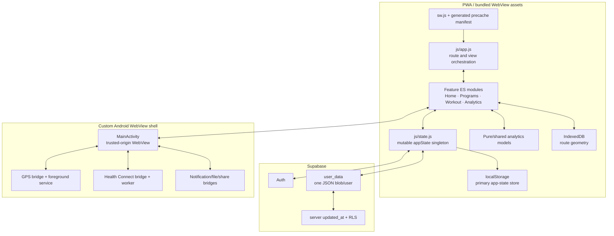
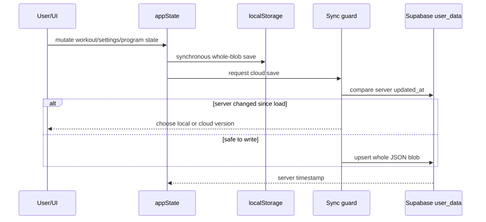
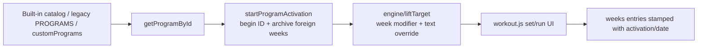
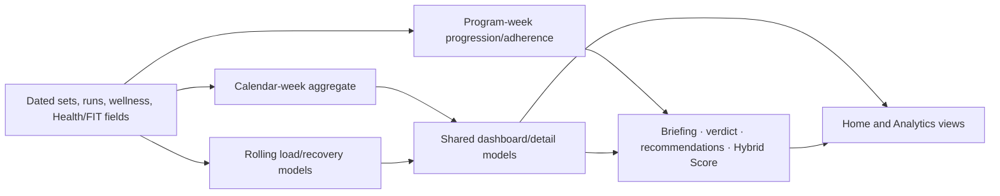

# Helyx Technical Architecture Audit

**Audit date:** 14 July 2026  
**Repository state:** `main` at `4079068`  
**Scope:** application modules, state and schema, migrations, cloud sync, IndexedDB routes, analytics, PWA/service worker, Android WebView/native bridges, Health Connect, security, tests, and release workflows

## Architecture verdict

The architecture is viable for the current product, but its durability boundaries are inconsistent. The ES-module graph is modular enough to avoid an urgent framework rewrite; all 151 non-vendor modules inspected were reachable from application or service-worker entry points. The more important problem is that state, route storage, cloud sync, and native tracking disagree about identity, atomicity, and recovery.

**Architecture score: 6.2/10**  
**Data-integrity readiness: 4.5/10**  
**Security baseline: 7.0/10**  
**Release confidence: 5.0/10**

## System map



## Entry points, navigation, and responsibility map

- `index.html` is the application shell, static view/dialog inventory, CSP, and module bootstrap surface.
- `js/app.js` is the main entry/orchestrator. It wires delegated actions, feature initialization, navigation/view refresh, imports, and cross-feature UI state.
- Bottom navigation and internal view/sheet handlers replace visible sections inside one document; this is not a URL-routed SPA with independent route history.
- `js/state.js` owns the mutable singleton, persistence-facing mutation helpers, program resolver, activation start, and cloud coordination.
- `js/programs/catalog.js` combines category registries; `js/state.js:getProgramById` also resolves custom programs and legacy `PROGRAMS`, creating a dual-registry compatibility boundary.
- `js/engine.js` materializes weekly/day prescriptions and progression diagnostics for the workout cockpit.
- `js/workout.js` owns live-session rendering and much of its interaction/completion logic; `js/run-logger.js`, `js/gps-tracker.js`, and workout helpers cover adjacent flows.
- `js/analytics/dashboard-model.js` and the analytics modules feed Home/detail views; `js/brain/*` adds deterministic recommendations, briefing, verdicts, and Hybrid Score.
- `js/garmin.js` lazily loads the vendored FIT parser, extracts the first matching session/laps/records, and sends normalized fields to callbacks in `js/app.js`, which write the active workout/run context.
- `sw.js` and generated precache data own offline asset lifecycle. Android `MainActivity.kt` hosts the bundled origin and attaches GPS, Health, notification, and file/share bridges.

### Purity and side effects

| Intended pure/model-oriented modules | Side-effect/orchestration modules |
|---|---|
| calendar aggregation, week navigation, strength calendar/calculations, load/readiness formulas, program timeline/compare/progression, plate math, workout order/substitution, activation identity, sync-guard comparison | `app.js`, `state.js`, `settings.js`, `workout.js`, `home.js`, program library/detail renderers, `garmin.js` file parsing callbacks, `db.js` IndexedDB, auth/Supabase adapters, service worker, GPS/Health/notification bridges |

Some intended model modules still read the global singleton (notably engine/history paths), and several renderers calculate domain meaning while producing HTML. The refactoring priority is to extract the policies that currently cause defects—completion, phases, identity, migrations—not to pursue purity as a style goal.

## Main data flows

### Persistence and sync



### Program to workout



### Calculations and recommendations



The time-model separation is deliberate and largely correct: calendar graphs use recorded dates, program progression uses activation/current program week, and CTL/ATL/readiness use rolling windows. Problems arise where non-canonical day keys or global program-phase names enter those flows.

## State and persistence

### Current behavior

`appState` is a mutable singleton persisted as one JSON value in localStorage. The same object is uploaded as one Supabase `user_data.data` blob. Critical actions save immediately; form-like changes can use debounced persistence. The cloud layer compares the server-managed `updated_at` to the version loaded by this device before overwriting, presents a conflict choice, and retains a pre-pull local snapshot.

This is a reasonable beta architecture if the blob remains bounded and migrations are safe. It is not silently multi-writer safe and should not be described as merged sync.

### Strengths

- Server time, not client time, detects intervening cloud writes.
- Pre-pull snapshots provide a local recovery path.
- Program activations have stable IDs; old numeric weeks move under `arch:<activation>:<week>` keys instead of being reused.
- Calendar analytics iterate stamped records, so archived history can still count.
- Local state remains usable without auth/network.

### Critical defects

#### Migration atomicity

`migrateState` catches a migration error, continues, and ultimately stamps `schemaVersion` to the current version. This violates the central migration invariant: **the version may advance only when every preceding transformation succeeds**.

Required change:

1. clone the last known-good state;
2. execute exactly one version step;
3. validate its postcondition;
4. persist/advance that version only on success;
5. stop on failure, retain the original, surface recovery, and retry on next load;
6. make every migration idempotent and test forced failure between steps.

#### Import validation

`isAppState` checks only a small top-level shape. Imported settings, program IDs, dates, week/day records, routes, and displayable strings are not schema-validated before replacement. Imports should be parsed, validated, migrated, and summarized in memory; only then should a user-confirmed atomic replace occur.

#### Growth and write amplification

Lifetime history remains inside one state blob. A synthetic five-year state with 31,200 set records was about 1.41 MB and took about 4.8 ms to stringify in Node. That is not itself a failure, but it excludes browser main-thread contention, localStorage's synchronous write, cloud serialization, radio/network cost, and richer real records. Establish size/latency budgets and telemetry before the beta population grows.

Recommended medium-term boundary:

- keep settings, active plan, and small summaries in a versioned profile/state document;
- store immutable workout/run sessions as individually identified records;
- derive/rebuild aggregates from sessions;
- retain a portable versioned snapshot format.

This should be an incremental repository evolution, not a launch-blocking database rewrite.

## Identity model

### Program activations

Activation identity is one of the strongest parts of the system. `beginActivation` plus `archiveForeignWeeks` prevents prior-run sets from appearing in the current plan, while stamped dates preserve analytics history.

Remaining gaps:

- a mid-workout activation can proceed after a warning, archiving partial work out of the active cockpit;
- the UI cannot resume a previous activation;
- fallback program lookup can hide an invalid ID by displaying Hybrid Engine.

### Workout/run sessions

The identity boundary is incomplete:

- run state is stored as `weeks[week].runs[day]`;
- manual/GPS save replaces that slot;
- IndexedDB route upsert keys activation/week/day rather than a session;
- `getAllRoutes()` collapses activation-aware records into a legacy `week_day` object;
- route portability understands that collapsed representation;
- GPS start time is cleared before being copied into the saved route.

Introduce a stable `sessionId` at workout/run creation. A route should reference that session ID; activation/week/day remain indexed metadata, not identity. Legacy records can receive deterministic IDs during migration. Multiple sessions on one day must round-trip through JSON export/import.

## Time model

The repository correctly distinguishes calendar weeks, program weeks, and rolling windows in its canonical analytics. The defect is day-key creation outside that core.

Raw `Date`/`toISOString` patterns coexist with `todayKey`, `dateKey`, `localDayKey`, and `weekStartOf`. A local midnight converted to ISO becomes the prior day in positive UTC offsets. The immediate proof is three `streak_freeze` failures under Australia/Sydney and a browser-created bodyweight entry stamped one day earlier.

Required invariant:

> Every user-facing training/health day is represented by a local calendar key created by one canonical helper. UTC timestamps are retained separately for event ordering.

Tests must cover UTC-12, UTC, UTC+10/+14, daylight-saving transitions, Sunday/Monday boundaries, and clock changes while the app is backgrounded.

## Program and progression model

### Current schema

A program is predominantly a one-week `days` template plus `weeklyVolModifiers`. Lifts are bare strings. The engine applies a shared weekly sets/reps modifier, with a free-text name pattern as the principal per-lift override.

This is compact and explains why the catalog can be large, but it cannot reliably express:

- distinct targets per lift in the same week;
- set ranges, rep ranges, AMRAP, back-off, top-set, or warm-up structures;
- RPE/RIR/intensity targets and rest/tempo;
- supersets/circuits and exercise dependencies;
- structured run repetitions, recovery, zones, or progression;
- substitute-equipment constraints at prescription level.

Catalog inspection found 539 lift slots across 41 lift-containing programs, only 33 detected inline description targets, and 40 of those 41 programs with no detected inline target coverage. The default shared modifier is therefore the effective prescription for nearly all lifts.

### Recommended evolution

Do not replace bare strings across 150+ consumers in one change. Add a normalized resolver layer first:

```js
resolvePrescription({ program, activation, programWeek, dayKey, exerciseName })
// -> { sets, reps, repRange, load, rir, rpe, restSec, tempo, role, groupId, source }
```

The resolver can translate legacy strings/modifiers into a structured internal result. New/custom programs can adopt structured overrides behind the same API. Views and cockpit should consume only the resolver. Add a versioned serializer/migration after coverage exists.

### Progression history

`computeDiagnosticForLift` searches earlier numeric weeks in the same `dayKey`. It does not follow an exercise across weekdays or archived activations. Exercise identity should be name-key based initially (consistent with current analytics), and history queries should scan all retained sessions by stamped date, with optional current-activation scope where program logic requires it.

## Analytics and coaching

### Strong architecture

- `weekly-aggregate.js` is the shared calendar-week source.
- detail navigation is calendar-based and ephemeral.
- strength calendar summaries compare the same exercise within calendar weeks.
- analytics verification and synthetic performance checks pass.
- Hybrid Score carries provisional/confidence metadata.

### Accuracy risks

1. **Program phases:** a global `WEEK_PHASE_NAMES` source is used in Home/app/Hybrid Score instead of the active program modifier, affecting labels and possibly score weighting.
2. **Readiness confidence:** available signals are renormalized to a full score, but the result does not expose how many signals exist. One input can drive a high-confidence-sounding recommendation.
3. **Recommendation specificity:** favorable ACWR/TSB can trigger PR, time-trial, or back-off advice without exercise/distance-specific evidence.
4. **Scope labels:** strength “lifetime PR” can be calculated only from active numeric program weeks.
5. **Running performance:** best qualifying VDOT treats a broad range of runs as race-like without RPE or robust outlier checks.
6. **Formula duplication:** older load/readiness exports remain available alongside the main scoring path, increasing drift risk.
7. **FIT semantics:** `js/garmin.js:extractData` assigns an anaerobic training-effect search to `aerobicTE` and emits “Garmin Imported” before its destination callback has completed persistence.

All advice models should return `{value, confidence, evidence, contraindications, scope}`. Presentation copy should be selected from that object, not from the value alone.

## PWA and offline architecture

The service-worker design is strong:

- required assets are generated from the reachable import graph;
- install uses an atomic required precache;
- incomplete caches are rejected;
- activation cleans older versions;
- update UI prompts/reloads rather than silently mixing versions.

Risks/next checks:

- run a full install → offline launch → update available → update accepted → offline relaunch matrix in Chromium and Android WebView;
- confirm import/export and native bridges while offline;
- ensure a failed optional asset does not invalidate required functionality;
- add this lifecycle to automated browser coverage once Playwright is a declared dev dependency.

## Android shell and native integrations

### WebView security baseline

Positive controls include:

- bundled assets served from the appassets origin;
- cleartext disabled except explicit local development policy;
- exact trusted-origin parsing;
- file/content access disabled;
- WebView debugging limited to debug builds;
- minimum SDK 26;
- bridge methods constrained by origin checks.

### Export integration

Web JSON/CSV flows create an object URL and click an anchor. `MainActivity.handleDownload` recognizes data/http/https but not `blob:`. A text-file native bridge already exists but these export paths do not call it.

This is a public-beta blocker because route geometry is local-only and export is the user's portability/backup path. Implement one platform adapter and verify via emulator/device that:

- JSON and CSV open a real system save/share flow;
- cancellation is reported accurately;
- large exports do not cross unsafe JavaScript-interface payload limits;
- the saved file can be imported after app data is cleared.

### GPS durability

The foreground service is the correct direction for screen-lock tracking. However, points are held in a process-memory singleton and the service is `START_NOT_STICKY`. Process death can lose the session. Persist an append-only active-session journal (Room/file) with periodic flush, restore it on restart, and commit/delete it atomically on stop/discard.

The JS filter rejects low accuracy and tiny jitter but does not robustly reject teleport/speed outliers. Keep raw points for audit/reprocessing and derive a filtered distance with explicit quality metadata.

### Health Connect

The settings UI exposes per-field sync choices, but request/apply logic does not use those selections. Native and manifest capabilities also diverge: VO2 max is presented without a reader, and HRV/history declarations are inconsistent.

Required contract:

```text
settings selection
  -> exact requested permissions
  -> exact native read types
  -> exact JS fields accepted
  -> visible last-sync result per field
```

The periodic worker currently writes a snapshot that no consumer reads. Either use it for a defined background-sync outcome or remove the work until that outcome exists.

### Bridge safety

Other bridges use escaping helpers before `evaluateJavascript`; Health Connect interpolates callback IDs directly. Generated callback IDs are currently safe, so this is hardening rather than a demonstrated exploit. Apply the same `BridgeSafe` contract to every bridge and centralize callback construction.

## Security and privacy

### Existing strengths

- Supabase RLS is documented as applied and adversarially verified.
- The public anon key is treated correctly as non-secret, with authorization delegated to RLS.
- trusted-origin and WebView hardening reduce bridge exposure.
- Sentry is DSN-gated and health/location PII is scrubbed.
- Android backup is disabled, appropriate for sensitive local data.
- account deletion and local cleanup paths exist.

### Findings

#### Remote code in a privileged origin

The CSP permits scripts from jsDelivr. Supabase is pinned with SRI; the remote Sentry SDK does not have the same integrity control. In Android, that script executes on the same trusted appassets page that owns native bridges. Vendor all runtime JavaScript into the signed bundle, or pin exact assets with SRI and a narrow CSP. A signed mobile shell should not rely on mutable remote executable code.

#### Stored/imported markup surface

Celebration markup interpolates a title that can include the onboarding name, despite a comment treating it as app-only content. Avatar data from a shallowly validated import is placed into HTML attributes. Prefer DOM `textContent`/property assignment and validate imported data URLs by media type/size. Treat all imported snapshot content as untrusted.

#### Sync model disclosure

Cloud state remains blob-level last-write-wins after an explicit conflict choice. Document that limitation in user-facing sync help and preserve downloadable snapshots. A conflict resolver must never imply field merge.

## Code structure and maintainability

### Dead, legacy, duplicate, and partially migrated paths

| Classification | Evidence | Recommendation |
|---|---|---|
| Partially migrated route model | v2 `routes` records have stable IDs/activation metadata, but `saveMapToDB` still upserts one record per activation/week/day, reads return the latest slot, and export collapses back to legacy `week_day`. The retained v1 `runMaps` store is a deliberate fallback. | Complete session-level identity/export before removing v1 compatibility; do not treat the presence of an `id` as multi-run support. |
| Dual program registry compatibility | `getProgramById` checks custom programs, legacy `PROGRAMS`, then catalog entries and silently defaults. | Keep an adapter while converging on one validated registry; remove only with snapshot/catalog fixtures. |
| Duplicate metric families | `metrics-load.js` readiness/recovery exports coexist with the primary readiness/scoring path; some view/briefing status strings are recalculated. | Choose supported model APIs, add golden tests, then deprecate/restrict re-exports. |
| Unused/legacy exports | Call-site search found production-unreferenced engine import/export triggers, `computeEstimated1RMs`, and `findLastPerformance` (tests exercise some). | Confirm via coverage/build graph, then remove or make the intended history helper the canonical R21 query. |
| Unused native/JS Health paths | Native `readHealthData`/callback-style hooks and `window.onHealthConnectData` are not used by the current callback-ID path; `HealthSyncWorker.KEY_SNAPSHOT` is written but no app consumer reads it. | Delete after device-contract coverage, or wire to a defined background-sync result. Do not keep background work without a consumer. |
| Global bridge compatibility | several `window.*` bridge/callback entry points exist because WebView JavaScript interfaces require a global boundary. | Keep the required boundary thin, validate/escape there, and forward into module APIs; this is platform compatibility, not automatically dead code. |

No wholesale dead-module deletion is recommended: the reachability scan found every non-vendor module in the app/service-worker graph. The actionable debt is unused exports and half-completed format transitions inside reachable modules.

Large modules increase change risk:

| Module | Approx. lines | Risk |
|---|---:|---|
| `js/workout.js` | 1,870 | Live-session state, rendering, input, completion, and navigation share one file. |
| `js/app.js` | 1,407 | Routing, home/briefing orchestration, and cross-feature wiring are coupled. |
| `js/programs/detail.js` | 1,086 | Rendering, activation, preview, and plan concerns are mixed. |
| `js/programs/library.js` | 902 | Discovery state and rendering complexity. |
| `js/settings.js` | 851 | Account, health, export/import, preferences, and dialogs. |
| `js/state.js` | 847 | Persistence, cloud, activation, and mutation API concentration. |

Split only along tested seams:

- workout session model/completion policy/render controller;
- state repository/local adapter/cloud adapter/migration runner;
- settings portability/health/account subsections;
- program query/filter view model versus renderer.

Do not perform a mechanical file split without behavioral tests.

CSS also carries maintenance debt: approximately 12.4k lines, 704 inline style occurrences in HTML/JS, and 526 `!important` occurrences. Introduce primitives incrementally on touched views.

## Test and release architecture

### Current validation result

- Typecheck: pass.
- Precache check: pass.
- Node tests: 760 pass, 4 fail: three streak-freeze timezone failures and one date-relative coach-memory fixture that splits intended weeks depending on the current weekday.
- Smoke render/import: pass.
- Analytics correctness/perf scripts: pass.
- Browser viewport scripts: silently skip on clean install because Playwright is not declared.
- Android local suite: not executed; no Gradle wrapper and local JDK differs from CI's JDK 17.

### Coverage gaps

- full onboarding result persistence;
- partial versus completed workout policy;
- same-day multi-run identity and route round trips;
- forced migration failure/rollback/retry;
- Android blob/text export and import restoration;
- Health Connect permission-field contract;
- GPS process-death recovery and point-quality filtering;
- closed-modal accessibility and Android back-stack behavior;
- PWA offline/update lifecycle;
- remote script/CSP bundle invariants.

### Workflow risk

Tests, Android validation, Pages deployment, and signed release workflows trigger independently. Production publication is not causally dependent on green verification. Consolidate into reusable workflows or make deployment/release jobs depend on required verification jobs. Signed artifact steps must never run if JS tests/typecheck/precache or Android unit/lint/assemble fail.

## Recommended architecture sequence

1. **Integrity boundary:** canonical local days, session/run IDs, transactional migrations, Android export, gated workflows.
2. **Truth boundary:** persist onboarding settings, central phase resolver, completion policy, advice confidence.
3. **Platform boundary:** accessible modal stack, Health Connect contract, durable GPS journal, universal bridge escaping.
4. **Model evolution:** prescription resolver and all-history exercise query.
5. **Scale:** session-oriented persistence/cloud design informed by beta telemetry and export compatibility.

## Explicit non-recommendations

- Do not migrate to React/Vue/Svelte before fixing data identity.
- Do not move to Capacitor/TWA or add iOS during the current Android launch push.
- Do not add AI-generated training prescriptions while the deterministic prescription schema cannot represent the output safely.
- Do not replace blob sync without a versioned migration/export plan.
- Do not add more metrics until confidence, scope, and recommendation evidence are unified.

The architecture can support a public beta after a focused hardening phase. Its next milestone is not “more modular” in the abstract; it is that every workout, run, day, migration, export, and release has one durable identity and one verifiable success condition.
